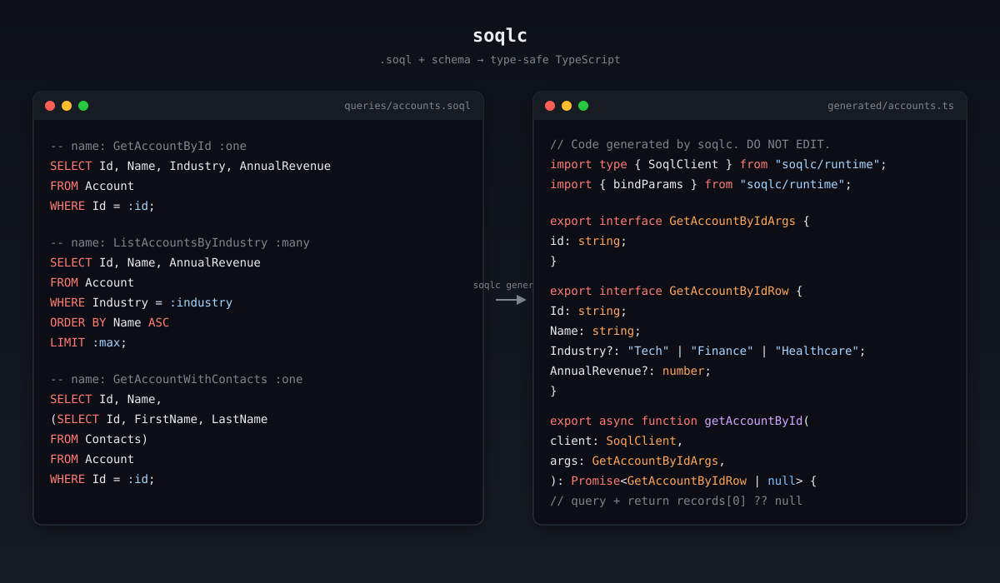

# soqlc

Generate **type-safe TypeScript** code from SOQL queries.



soqlc is to SOQL what [sqlc](https://github.com/sqlc-dev/sqlc) is to SQL: you
write `.soql` files and a schema describing your sObjects, and soqlc emits
strongly-typed TypeScript functions that execute those queries through a
driver-agnostic client interface.

```bash
soqlc generate     # parse + analyze + emit code
soqlc compile      # parse + analyze only (no output)
soqlc init         # scaffold a new project
```

## Status

**v0 — TypeScript only.** Go, Kotlin, and Python codegen are planned but
deferred. See `docs/roadmap.md`.

## How it works

```
.soql query files  ─┐
                    ├──►  parse  ──►  analyze (against schema)  ──►  emit TS
schema.soql.json   ─┘
```

The emitted TypeScript imports a `SoqlClient` interface from `@soqlc/runtime`.
You implement (or adapt) that interface using jsforce, `@salesforce/core`, or
plain `fetch`. soqlc doesn't tie you to a particular Salesforce SDK.

## Example

A complete walkthrough using three input files and one command. The full
project this is taken from lives in [`examples/basic/`](examples/basic).

### 1. Describe your sObjects — `schema.soql.json`

```json
{
  "version": "1",
  "sObjects": [
    {
      "name": "Account",
      "fields": [
        { "name": "Id", "type": "Id", "nillable": false },
        { "name": "Name", "type": "String", "nillable": false },
        { "name": "AnnualRevenue", "type": "Currency", "nillable": true },
        {
          "name": "Industry",
          "type": "Picklist",
          "nillable": true,
          "picklistValues": ["Tech", "Finance", "Healthcare"]
        }
      ]
    }
  ]
}
```

### 2. Write SOQL queries — `queries/accounts.soql`

```sql
-- name: GetAccountById :one
SELECT Id, Name, Industry, AnnualRevenue
FROM Account
WHERE Id = :id;

-- name: ListAccountsByIndustry :many
SELECT Id, Name, AnnualRevenue
FROM Account
WHERE Industry = :industry
ORDER BY Name ASC
LIMIT :max;
```

The `-- name: <Name> :one|:many` header mirrors sqlc. `:one` returns a single
row (or `null`); `:many` returns an array. `:param` placeholders become typed
function arguments.

### 3. Configure soqlc — `soqlc.yaml`

```yaml
version: "1"
soql:
  - schema: ./schema.soql.json
    queries: ./queries/**/*.soql
    apiVersion: "60.0"
    gen:
      typescript:
        out: ./src/generated
        emitRuntimeImport: "soqlc/runtime"
```

### 4. Generate

```bash
pnpm soqlc generate
```

soqlc emits `src/generated/accounts.ts` containing — for the first query —
roughly this:

```ts
// Code generated by soqlc. DO NOT EDIT.
import type { SoqlClient } from "soqlc/runtime";
import { bindParams } from "soqlc/runtime";

export interface GetAccountByIdArgs {
  id: string;
}

export interface GetAccountByIdRow {
  Id: string;
  Name: string;
  Industry?: "Tech" | "Finance" | "Healthcare";
  AnnualRevenue?: number;
}

export async function getAccountById(
  client: SoqlClient,
  args: GetAccountByIdArgs,
): Promise<GetAccountByIdRow | null> {
  const soql = bindParams(GetAccountByIdQuery, args);
  const result = await client.query<GetAccountByIdRow>(soql);
  return result.records[0] ?? null;
}
```

Note that `Industry` is narrowed to the picklist's literal union — not just
`string`.

### 5. Provide a `SoqlClient` and call your queries

`SoqlClient` is a tiny interface; wire it to whatever SDK you use. A `fetch`
adapter against the Salesforce REST API:

```ts
import type { SoqlClient } from "soqlc/runtime";

function makeRestClient(instanceUrl: string, accessToken: string): SoqlClient {
  return {
    async query(soql) {
      const url = `${instanceUrl}/services/data/v60.0/query?q=${encodeURIComponent(soql)}`;
      const res = await fetch(url, { headers: { Authorization: `Bearer ${accessToken}` } });
      if (!res.ok) throw new Error(await res.text());
      return res.json();
    },
  };
}
```

Then call the generated functions like any other typed code:

```ts
import { getAccountById, listAccountsByIndustry } from "./generated/accounts.js";

const client = makeRestClient(process.env.SF_INSTANCE_URL!, process.env.SF_ACCESS_TOKEN!);

const account = await getAccountById(client, { id: "001AAA" });
//    ^? GetAccountByIdRow | null

const techCos = await listAccountsByIndustry(client, { industry: "Tech", max: 10 });
//    ^? ListAccountsByIndustryRow[]   — and "Tech" is checked at the call site
```

If you pass `{ industry: "Marketing" }` you get a compile error — the picklist
union only accepts `"Tech" | "Finance" | "Healthcare"`.

## Quick start

```bash
pnpm install
pnpm soqlc init
# edit schema.soql.json + queries/*.soql
pnpm soqlc generate
```

See `examples/basic/` for a runnable example with a fake in-memory client.

## Docs

- [docs/architecture.md](docs/architecture.md) — parse → analyze → codegen pipeline
- [docs/config.md](docs/config.md) — `soqlc.yaml` reference
- [docs/schema-format.md](docs/schema-format.md) — `schema.soql.json` reference
- [docs/query-syntax.md](docs/query-syntax.md) — `.soql` file conventions + supported subset
- [docs/type-mapping.md](docs/type-mapping.md) — SOQL → TypeScript type mapping
- [docs/codegen.md](docs/codegen.md) — emitted code shape + runtime contract
- [docs/roadmap.md](docs/roadmap.md) — what's deferred

## License

MIT — see [LICENSE](LICENSE). Inspired by [sqlc](https://github.com/sqlc-dev/sqlc) (also MIT).
